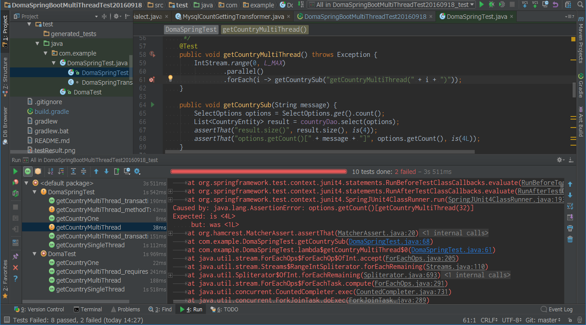

# DomaSpringBootMultiThreadTest20160918
```doma-spring-boot-starter:1.1.0``` を使用してマルチスレッドで検索を実行した場合に ```SelectOptions#getCount``` が正しい結果を返さない場合があることをテストするためのソースコード

## 現象が発生したDBMS
MySQL 5.6 （それ以外は未確認だが同様の現象が発生する可能性はあると推測する）

## 課題
以下のテストコードにおいて ```countryDao.select(options)``` の検索結果が４件の場合であっても、
```assertThat("options.getCount()[" + message + "]", options.getCount(), is(4L));``` がエラーになる場合がある。

結論を先に書くとこの実装は正しい実装ではない（正しい実装は後述）

```
    @Test
    public void getCountryMultiThread() throws Exception {
        IntStream.range(0, L_MAX)
                .parallel()
                .forEach(i -> getCountrySub("getCountryMultiThread(" + i + ")"));
    }

    public void getCountrySub(String message) {
        SelectOptions options = SelectOptions.get().count();
        List<CountryEntity> result = countryDao.select(options);
        assertThat("result.size()", result.size(), is(4));
        assertThat("options.getCount()[" + message + "]", options.getCount(), is(4L));
}
```
エラー時のスタックトレース
```
Caused by: java.lang.AssertionError: options.getCount()[getCountryMultiThread(32)]
Expected: is <4L>
     but: was <1L>
	at org.hamcrest.MatcherAssert.assertThat(MatcherAssert.java:20)
	at org.junit.Assert.assertThat(Assert.java:956)
```

## AssertionErrorが起きる理由
* ```SelectOptions#count()``` した場合には、メインの検索ＳＱＬを実行した直後に件数取得用のSQLを実行する。
	* MySQL では、```select found_rows``` という SQL を実行している。この SQL の意味は、直前の検索ＳＱＬの件数を得るという検索である
	* ソースレベルで確認したところ、それ以外の DBでは、```select count(*) from (メインのSQL)``` を実行して件数を取得している模様
* 上記のソースコードだと Spring は トランザクション管理をしない。結果、「メインの検索ＳＱＬ」「件数取得用のSQL」が別のトランザクション（または、別のDBコネクション）で実行される可能性がある。
* 上記２点を合わせると
	* MySQL では、件数取得用のＳＱＬを実行する際にメインの検索処理を実行したＤＢコネクションとは別のＤＢコネクションで実行される可能性がある。別のＤＢコネクションで実行されると該当コネクションでの「直前の検索ＳＱＬの値」が設定されてしまうので誤った結果を返す。
	* それ以外の DB の場合も、読取一貫性の設定によっては異なる結果が返ってくる可能性がある。


## 解決するためのソースコード

トランザクション管理をすれば良い。
```
@RunWith(SpringJUnit4ClassRunner.class)
@SpringApplicationConfiguration(classes = DomaCountTestApplication.class)
public class DomaSpringTest {
    private static int L_MAX = 100;

    @Autowired
    DomaSpringTransactionalTest domaSpringTransactionalTest;

    @Test
    public void getCountryMultiThread_di_tx() throws Exception {
        IntStream.range(0, L_MAX)
                .parallel()
                .forEach(i -> domaSpringTransactionalTest.getCountrySub("getCountryMultiThread_tx(" + i + ")"));
    }
}

@Component
class DomaSpringTransactionalTest {
    @Autowired
    CountrySpringDao countryDao;

    @Transactional
    public void getCountrySub(String message) {
        SelectOptions options = SelectOptions.get().count();
        List<CountryEntity> result = countryDao.select(options);
        assertThat("result.size()", result.size(), is(4));
        assertThat("options.getCount()[" + message + "]", options.getCount(), is(4L));
    }
}
```


# このリポジトリに含まれている物
このリポジトリは上記の現象を確認するためのソースコードが含まれている。

## 含まれている内容
以下の２種類の内容が含まれる
* テスト実行に必要なテーブル作成スクリプト及びデータ作成スクリプト（flyway を使用してSpring起動時に作成）
* doma-spring-boot-starter を使ったテスト（＝現象再現用）
* Springを使わずに DOMA 単体でのテスト（＝DOMAの問題ではないことを確認するため）

以下の物は含まれていないので事前に作成する必要がある
* MySQL サーバ 及び 接続ユーザ 、database

## 事前準備
### 共通
* MySQL サーバ 及び 接続ユーザ 、database

### DOMAの実行環境設定
#### IDE として Intellij を使う場合
* Menu bar > File > Settings > Build, Execution, Deployment > Compiler > Annotation Processors
    * Enable annotation processing -> check on
    * Store generated sources relative to: Module content root
* Gradle task の compileJava を実行 -> src/main/generated というフォルダができる。
* src/main/generated を右クリックして Mark Directory as ... から Generated Source Root に設定する。

#### IDE として Intellij 以外を使う場合
* 不明

### Database接続情報の設定
#### doma-spring-boot-starter を使ったテスト実行用
SpringBoot の流儀に従い「spring.datasource.url」「spring.datasource.username」「spring.datasource.password」を設定
#### DOMA 単体でのテスト実行用
src/main/java/com/example/AppConfig.java 内に datasource url username password を記載する
### テスト実行
JUnit で以下のテストクラスを実行する
* doma-spring-boot-starter を使ったテスト実行用
    * src/test/com/example/DomaSpringTest
* DOMA 単体でのテスト実行用
    * src/test/com/example/DomaTest

### 実行結果


## 現象確認した時の build.gradle に載っていない主な関連物のVersionなど
* DBServer : MySQL 5.6.29 MySQL Community Server (Linux x86_64)
* JUnit実行環境
    * OS : Windows10
    * IntelliJ IDEA (Community Edition) 2016.3 EAP Build #IC-163.4396.1, built on September 13, 2016
    * JDK 1.8.0_74
* doma-spring-boot-starter: 1.1.0
	* DOMA 2.12.0
* mysql-connector-java: 5.1.39
* 2016/09/18 23:00 現在
    * エラー発生を確認
        * MySQL5.6
    * エラー発生しないことを確認
        * SQLServer2016

